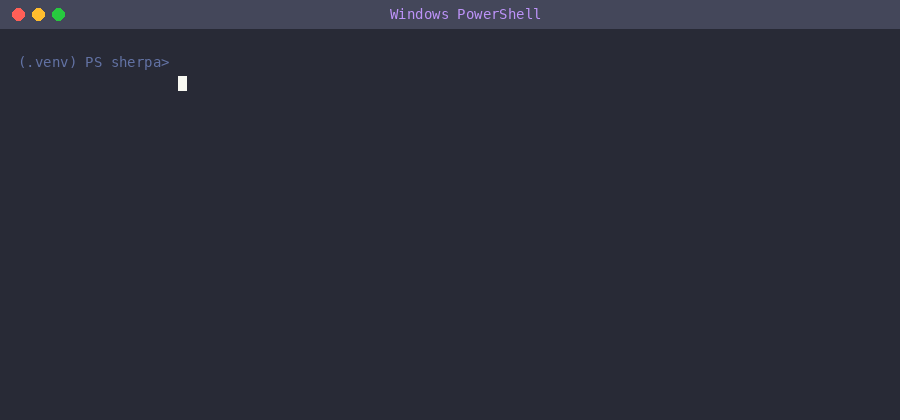

<div align="center">

# 🏔️ Sherpa

**Explains your terminal errors in plain English. Fully local, no API key, no internet after setup.**

[](https://www.python.org/downloads/)
[](LICENSE)
[](https://pypi.org/project/sherpa-dev/)

</div>

---



```
$ pip install rish
ERROR: Could not find a version that satisfies the requirement rish

$ python -m sherpa

sherpa is thinking...

Command: pip install rish

╭─ Why it failed ──────────────────────────────────────────────╮
│ The package 'rish' does not exist on PyPI. Pip searched all  │
│ available distributions and found no match.                  │
╰──────────────────────────────────────────────────────────────╯
╭─ Fix ────────────────────────────────────────────────────────╮
│ Check the package name spelling — did you mean 'rich'?       │
│ pip install rich                                             │
╰──────────────────────────────────────────────────────────────╯
```

---

## Install

```bash
pip install sherpa-dev
```

That's it. No compiler, no API key, no configuration. `pip install` only pulls in `click` and `rich` — two lightweight packages that install in seconds on any machine.

## First Run

```bash
python -m sherpa
```

On first run, Sherpa does two things automatically:

**Step 1 — Installs the AI engine**
`llama-cpp-python` installs itself silently with pre-built wheels. No compiler or build tools needed on most machines.

**Step 2 — Shows an interactive model picker**
Choose a model based on your available RAM:

```
╭─────────────────────────────────────────────────────╮
│ Choose a model based on your available RAM.         │
│ The model downloads once and is reused every run.   │
╰─────────────────────────────────────────────────────╯

  [1]  CodeLlama 7B Instruct (Q4)
       Size: ~4.0 GB   RAM: 8 GB+
       Best quality — code errors, tracebacks, build failures

  [2]  Mistral 7B Instruct (Q4)
       Size: ~4.1 GB   RAM: 8 GB+
       Great general errors, shell commands, config issues

  [3]  Gemma 2B Instruct (Q4)
       Size: ~1.6 GB   RAM: 4 GB+
       Low RAM machines — fast, decent quality

  [4]  Llama 3.2 3B Instruct (Q4)
       Size: ~2.0 GB   RAM: 6 GB+
       Good balance of speed and quality on mid-range machines

  [5]  DeepSeek Coder 6.7B Instruct (Q4)
       Size: ~3.8 GB   RAM: 8 GB+
       Best for pure code debugging

Enter model number [1-5]:
```

After the model downloads, every run is fully offline. No internet, no API key, no external server. Ever.

> ⏳ **First explanation takes 30–60 seconds** while the model loads into RAM. Every run after that is faster as the OS caches the model.

---

## Usage

```bash
# Explain last terminal error (default)
python -m sherpa

# Explain a specific line in a file
python -m sherpa explain app.py:42

# Ask a freeform question
python -m sherpa ask why is my API returning 403 only in production

# Show current config
python -m sherpa cfg show

# Switch to a different model
python -m sherpa cfg set-model /path/to/custom-model.gguf
```

> **Windows tip:** If `sherpa` is not recognised as a command after install, always use `python -m sherpa`. This works identically on all platforms.

---

## Why Sherpa?

Every developer hits errors in their terminal every day. The usual workflow:

1. Read the error → feel confused
2. Copy the error → open browser → Google/ChatGPT → read results → come back

That's a context switch. You leave your flow, lose your mental state, and waste 3–5 minutes on something that should take 5 seconds.

**Sherpa eliminates that loop.** The explanation and fix come to you, right where the error happened.

> 🔒 **Your code never leaves your machine.** Sherpa runs entirely locally using a quantized AI model. No data is sent anywhere. Ever.

### Why not just use ChatGPT?

| | Sherpa | ChatGPT / Copilot |
|---|---|---|
| Stays in terminal | ✅ | ❌ |
| Works offline | ✅ | ❌ |
| No API key | ✅ | ❌ |
| Code never leaves machine | ✅ | ❌ |
| Reads error automatically | ✅ | ❌ |
| Free forever | ✅ | ❌ |

---

## How It Works

```
python -m sherpa
  │
  ├─ setup.py     → installs llama-cpp-python automatically (first run only)
  ├─ setup.py     → interactive model picker + download (first run only)
  ├─ config.py    → loads ~/.sherpa/config.json
  ├─ history.py   → reads last command + stderr from shell history
  ├─ ai.py        → loads local GGUF model, runs inference
  └─ display.py   → prints explanation + fix with rich styling
```

| Component | Library | Purpose |
|---|---|---|
| CLI | `click` | Command routing, auto help text |
| Output | `rich` | Colors, panels, syntax highlighting, progress bars |
| AI engine | `llama-cpp-python` | Runs `.gguf` models inline, no server needed |

---

## Supported Models

Sherpa lets you pick your model on first run. You can switch anytime with `python -m sherpa cfg set-model`.

| # | Model | Size | RAM | Best for |
|---|---|---|---|---|
| 1 | CodeLlama 7B Instruct Q4 | ~4.0 GB | 8 GB+ | Code errors, tracebacks, build failures |
| 2 | Mistral 7B Instruct Q4 | ~4.1 GB | 8 GB+ | General errors, shell commands, config |
| 3 | Gemma 2B Instruct Q4 | ~1.6 GB | 4 GB+ | Low RAM machines, fast responses |
| 4 | Llama 3.2 3B Instruct Q4 | ~2.0 GB | 6 GB+ | Balanced speed and quality |
| 5 | DeepSeek Coder 6.7B Q4 | ~3.8 GB | 8 GB+ | Pure code debugging |

You can also use any custom `.gguf` model:

```bash
python -m sherpa cfg set-model /path/to/your-model.gguf
```

---

## Supported Shells

| Shell | Platform | Status |
|---|---|---|
| PowerShell | Windows | ✅ |
| Bash | Linux / macOS / WSL | ✅ |
| Zsh | macOS / Linux | ✅ |
| Fish | Linux / macOS | ✅ |

---

## Requirements

- Python 3.10+
- 4 GB RAM minimum (8 GB recommended for 7B models)
- Disk space for the model (1.6 GB – 4.1 GB depending on choice)
- Internet connection only for the one-time model download

---

## Troubleshooting

**`sherpa` command not found**
Use `python -m sherpa` instead. This works identically on all platforms.

**Blank screen / nothing happening after running**
The model is loading into RAM — this takes 30–60 seconds on first run. You will see:
```
Loading model into memory (this takes 30-60 seconds on first run)...
```
Just wait. It will respond.

**`llama-cpp-python` build error on Windows**
Install [Visual Studio Build Tools](https://aka.ms/vs/17/release/vs_BuildTools.exe) with "Desktop development with C++" checked, then run `python -m sherpa` again. The installer handles the rest automatically.

**"Could not read shell history"**
Run a command first (even a failing one), then run `python -m sherpa`. Sherpa reads from your live session history.

---

## Contributing

See [CONTRIBUTING.md](CONTRIBUTING.md) for open tasks and contribution guidelines.

Good first issues include adding `--brief` mode, pipe support (`cat error.log | python -m sherpa`), and a `sherpa watch` mode.

---

## License

[MIT](LICENSE)

---

<div align="center">

*Built with Python and llama-cpp-python · Fully local · Your code never leaves your machine*

**[PyPI](https://pypi.org/project/sherpa-dev/) · [GitHub](https://github.com/RishiiGamer2201/sherpa) · [Contributing](CONTRIBUTING.md)**

</div>
